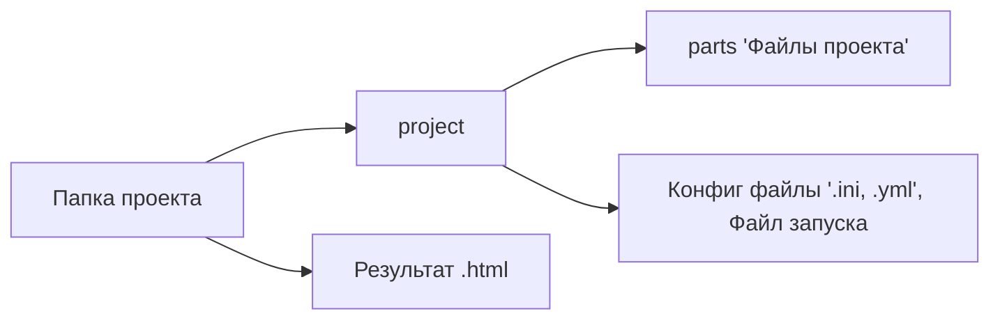
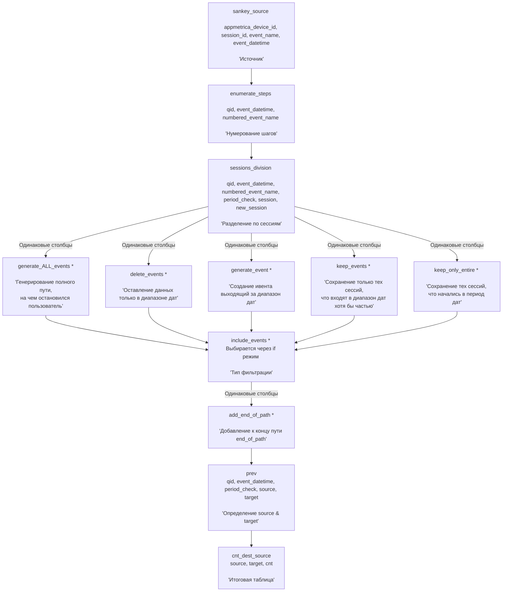
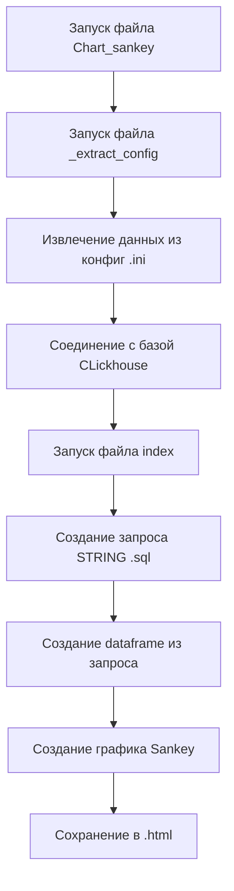
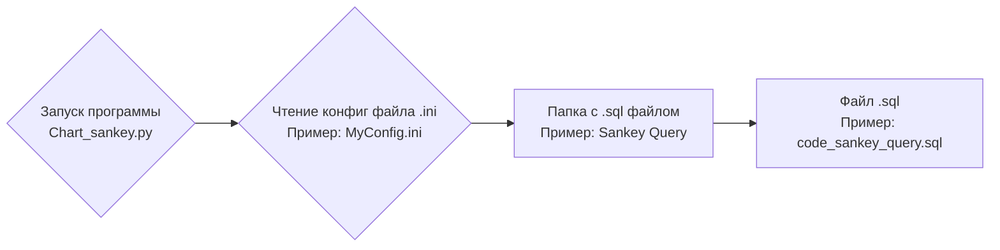

# Добро пожаловать в проект Sankey Chart для Adventum стажировки

Проект создается по таблице **events** в **clickhouse** базе данных.

Выполнялся в качестве задания https://analyticspace.adventum.ru/datacraft И Adventum adventum.ru

## Что включает себя проект?

### Файл .ini

    Файл, который включает себя подключение к базе данных Clickhouse в форме:
    
    [Default-Clickhouse]
    username=
    host=
    password=
    port=
    -- Имя базы данных:
    database=

    И пути до файлов для функции создания запроса SQL:

    [Default-Query]
    name_yml= Название yml файла, для переменных запроса
    name_folder= Название папки для файла SQL
    name_query= Название файла в папке SQL формата .sql

### Файл .yml

    Файл, который включает словарь переменных:

    ОБЯЗАТЕЛЬНО ИМЕЕТ

        vars:
            see_dates:
            table_name:
            time_after:
            time_before:
            include_events:
            session_time:
            max_step_target:
            end_of_path:

    Подробнее в самом файле.

# Важно сохранять иерархию проекта

Важно сохранять структуру проекта в таком же виде, что и ниже

[Для отображения схемы в VS CODE](https://marketplace.visualstudio.com/items?itemName=bierner.markdown-mermaid)

[Как выглядит проект (картинка)](project/parts/png_md/Как%20выглядит%20проект.png)

# Как выглядит запрос:

# Последовательность действий работы проекта:

# Откуда поступают данные:

